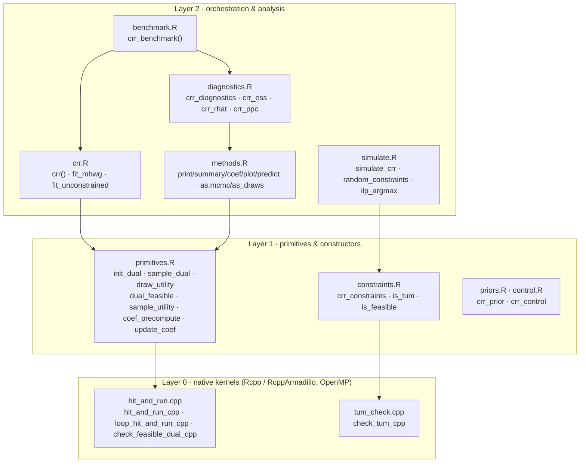

# combreg — code map

Bayesian regression for combinatorial response data. The package is organized
as a strict three-layer stack: native samplers at the base, exported R
primitives in the middle, and model orchestration plus diagnostics on top.
**Dependencies only ever point downward** — Layer 0 holds no R state, Layer 1
is the only caller of the kernels, and Layer 2 never reaches past the
primitives. Custom mean structures compose Layer 1 directly without touching
the sampler internals.

| | | |
|---|---|---|
| **v0.1.0** MH-within-Gibbs + dual augmentation | **22** exported functions | **4** C++ entry points · **7** S3 classes |

## Architecture



## The three layers

### Layer 2 — orchestration & analysis
User-facing entry points that compose the primitives.

| File | Role | Exported | Internal |
|---|---|---|---|
| `crr.R` | main entry; registry dispatch to a sampler | `crr` | `fit_mhwg`, `fit_unconstrained` |
| `methods.R` | S3 methods on `crr_fit` | `print`, `summary`, `coef`, `plot`, `predict`, `as.mcmc`, `as_draws` | `kept_draws`, `plot_*` helpers |
| `diagnostics.R` | MCMC + regression diagnostics | `crr_diagnostics`, `crr_ess`, `crr_rhat`, `crr_ppc`, `fitted`, `residuals` | `split_rhat`, `ppc_table` |
| `benchmark.R` | compare methods on shared data | `crr_benchmark` | — |
| `simulate.R` | synthetic data + random constraint systems | `simulate_crr`, `random_constraints` | `ilp_argmax` (needs lpSolve), `require_lpsolve` |

### Layer 1 — sampling primitives & constructors
Exported building blocks; reusable for custom mean structures.

| File | Role | Exported | Calls C++ |
|---|---|---|---|
| `primitives.R` | one Gibbs / MH block each | `init_dual`, `sample_dual`, `draw_utility`, `dual_feasible`, `sample_utility`, `coef_precompute`, `update_coef` | `sample_dual` → `loop_hit_and_run_cpp`; `dual_feasible` → `check_feasible_dual_cpp` |
| `constraints.R` | feasible-set definition + TUM check | `crr_constraints`, `is_tum`, `is_feasible` | `crr_constraints`, `is_tum` → `check_tum_cpp` |
| `priors.R`, `control.R` | validated parameter objects | `crr_prior`, `crr_control` | — |

### Layer 0 — native kernels
Rcpp / RcppArmadillo, OpenMP-parallel, no R state.

| File | Role | Entry points |
|---|---|---|
| `hit_and_run.cpp` | dual-polytope hit-and-run; per-chain RNG streams (thread-count invariant) | `hit_and_run_cpp`, `loop_hit_and_run_cpp` (OpenMP over observations), `check_feasible_dual_cpp` |
| `tum_check.cpp` | exhaustive total-unimodularity test | `check_tum_cpp` |
| `R/RcppExports.R`, `src/RcppExports.cpp` | generated R ↔ C++ bridge | — |

## The sampler, traced

What `crr(method = "mhwg")` runs each iteration:

1. **Dual refresh** — `U | ζ, y` — hit-and-run over the dual-certificate polytope, one chain per observation.
2. **Utility MH** — `ζ | U, β, y` — propose a coordinate block, form the envelope, accept per row by feasibility.
3. **Conjugate draw** — `β | ζ` — Gaussian update via a cached Cholesky factor.

```
crr()  →  fit_mhwg()                                   [Layer 2]  seed, allocate draws, loop n_iter
  1 ·  sample_dual()      → loop_hit_and_run_cpp        [L1→L0]   OpenMP across observations
  2 ·  sample_utility()                                 [L1]      orchestrates the MH envelope step:
         → draw_utility()                               [L1]      truncated-normal proposal
         → sample_dual()  → loop_hit_and_run_cpp        [L1→L0]   U* under the envelope
         → dual_feasible() → check_feasible_dual_cpp    [L1→L0]   per-row accept test
  3 ·  update_coef()                                    [L1]      uses coef_precompute() factor (V, L)
```

Note the two hit-and-run sweeps per iteration (steps 1 and 2) — the sampler's
dominant cost. `fit_unconstrained` (the Albert–Chib probit baseline) shares
`coef_precompute`, `draw_utility`, and `update_coef` but skips the dual
machinery entirely.

## Around the edges

**External dependencies**

| Package | Used for | Requirement |
|---|---|---|
| Rcpp / RcppArmadillo | Armadillo kernels, `useDynLib` | Imports / LinkingTo |
| coda | `as.mcmc`, `effectiveSize` (ESS) | Imports |
| truncnorm | `rtruncnorm` in `draw_utility` | Imports |
| stats, graphics, grDevices, utils | `chol`, `solve`, `rnorm`, `rexp`, `acf`, plotting | Imports |
| lpSolve | ILP argmax — `simulate_crr` & `predict(type = "response")` | Suggests |
| posterior | `as_draws` converter | Suggests |

**S3 classes** — `crr_fit` (the model), `crr_constraints` (feasible set),
`crr_prior`, `crr_control`, `crr_diagnostics`, `crr_ppc` (predictive checks),
`crr_benchmark`.

**Not shipped in the package** (development / research assets, kept out of the
CRAN tarball via `.Rbuildignore`) — `experiments/zeta_block_experiment.R`
(block-size research harness), `inst/scripts/reproduce-table2.R` (paper
reproduction; note this one *is* installed, under `inst/`).
